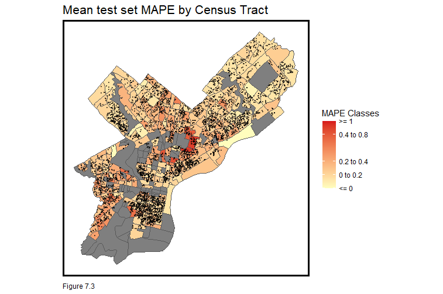

# Introduction

The Philadelphia housing market is a dynamic and diverse landscape influenced by various factors that impact both prices and overall market conditions. This market reflects the economic and social dynamics of the city and the surrounding region.It encompasses a wide range of neighborhoods, each with its unique character, amenities, and housing styles. The city's diverse housing stock includes rowhouses, townhomes, apartments, and single-family homes, catering to a variety of lifestyles and preferences.


Significance of project

Housing prices in Philadelphia have experienced fluctuations over the years, influenced by a combination of local and national factors. However, it's important to note that these prices can vary significantly based on factors such as the neighborhood, property type, and condition of the home. 

Sale prediction algorithms are powerful tools that offer benefits to a wide range of stakeholders in the housing market. They promote informed decision-making, uncover inequalities, and contribute to the overall health and fairness of the real estate market.

This project builds on this theory and aims to evaluate the various factors affecting housing prices to create an accurate and generalizable OLS regression model to predict the housing prices in Philadelphia.

Key challenges

Building a predictive model for property valuation is difficult given the intricacies involved in data processing and interpretation.  It involves sorting through lots of data, choosing the right features, understanding the nuanced influence of neighborhood characteristics, addressing collinearity among variables, selecting appropriate modeling techniques, evaluating model performance, ensuring interpretability, and building a generalizable model. 

## Process

The process of creating this model was extremely iterative, and involved multiple rounds of trial and error, particularly in attempts to minimize the errors in predictions. The maps, correlation matrix and scatterplots are all illustrative of variables that were considered, wrangled and filtered as part of the data analysis process.  

## Summary of Results

The model exhibits moderate generalizability, however, the presence of notably high errors raises concerns about its predictive accuracy. In our process of experimentation, we were able to predict approximately 70% of the variance in sale prices, which is a reasonable level of explanatory power for a regression model. The errors across the model seem to be dispersed and do not display any significant spatial auto-correlation. 

This code is built upon the classwork discussed [here](https://github.com/mafichman/musa_5080_2023/tree/main).

```{r Setup Knitting Parameters, include=FALSE}
  knitr::opts_chunk$set(
    echo = TRUE,
    warning = FALSE,
    message = FALSE,
   out.width = '100%',
    fig.retina =3
  )
```

## R Setup and Installing Packages

This code chunk handles the essential tasks of loading necessary packages, configuring the Census API key, defining class functions, specifying a color palette, and managing global environment settings.

```{r Set up Packages, warning = FALSE, message = FALSE}

# Loading libraries

library(tidyverse)
library(tidycensus)
library(sf)
library(kableExtra)
library(tidyr)
library(ggplot2)
library(viridis)
library(stringr)
library(tigris)
library(ggcorrplot)
library(stargazer)
library(dplyr)
library(caTools)
library(spdep)
library(caret)
library(jtools)     
library(ggstance) 
library(ggpubr)    
library(broom.mixed) 

# Setting parameters for scientific notation

options(scipen=999)
options(tigris_class = "sf")

# Functions and data directory

source("https://raw.githubusercontent.com/urbanSpatial/Public-Policy-Analytics-Landing/master/functions.r")

# Invoking color palettes to be used

palettee <- c('#d7191c','#fdae61','#ffffbf','#abd9e9','#2c7bb6')

# Registering API Key to be used

census_api_key('bf2d507651b5a621dbadd44533fb4f3deaab26bf', overwrite = TRUE)

```

# Data Wrangling

Census, OpenData Philly and provided Dataset 

## Provided Dataset and Internal Variables 

The code below is used to import the foundational dataset for our model. This dataset contains information on home sales prices and property characteristics in Philadelphia, Pennsylvania for the years 2022 and 2023. The model we are developing is designed to make predictions about home prices and utilizes specific property attributes from this dataset to enhance the accuracy of those predictions.

The code demonstrates data manipulation using the dplyr package to refine the dataset by selecting specific columns and filtering rows based on criteria. These operations are carried out because the raw dataset is untidy and incomplete. The original dataset is further modified by filtering rows specific to Philadelphia City and by excluding certain columns with a majority of missing values.

```{r Reading Data, results= 'hide'}

# Reading Data

data <- 
  st_read("./data/studentData.geojson") %>%
  st_transform('ESRI:102286')

# Dropping columns with no values and filtering values within Philadelphia

data <-  data %>% 
  select(-cross_reference, -date_exterior_condition, -mailing_address_2, -mailing_care_of, -unfinished, -utility, -category_code, -category_code_description, -exempt_land, -separate_utilities, -sewer, - site_type, -house_extension, -street_direction, -suffix, -garage_type, -general_construction )%>% 
  filter(mailing_city_state == "PHILADELPHIA PA" )

```
### Categorical Variables 

The next step is predominantly focused on data cleaning and transformation based on the information given in the metadata for the dataset by the City of Philadelphia. Overall, this code aims to clean and categorize various columns in the dataset. It does this by handling missing values as well as assigning categories and binary values for better analysis and modeling.


```{r Cleaning Data based on Metadata, results= 'hide'}

## Filtering out 9 rows where year built is not given

data <-  data %>% 
  filter(year_built > 0 )

## Categorizing if a Basement is present

data <- data %>%
  mutate(BasementPresent = case_when(basements == 'A' |
  basements == 'B' |
  basements == 'C' |
  basements == 'D' |
  basements == 'E' |
  basements == 'F' |
  basements == 'G' |
  basements == 'H' |
  basements == 'I' |
  basements == 'J' ~ 1,
  basements == '0' ~ 0))

# Assigning value of 0 to 'NA' rows based on description in metadata

data$BasementPresent[is.na(data$BasementPresent)] <- 0

## Categorizing Basement Type

library(dplyr)

data <- data %>%
  mutate(BasementType = case_when(basements == 'A' ~ 'Full size finished',
  basements == 'B' ~ 'Full size semi-finished',
  basements == 'C' ~ 'Full size unfinished',
  basements == 'D' ~ 'Full size unknown finish',
  basements == 'E' ~ 'Partial size finished',
  basements == 'F' ~ 'Partial size semi-finished',
  basements == 'G' ~ 'Partial size unfinished',
  basements == 'H' ~ 'Partial size unknown finish',
  basements == 'I' ~ 'Unknown size finished',
  basements == 'J' ~ 'Unknown size unfinished',
  basements == '0' ~ 'No basement'))

# Assigning value of 0 to 'NA' rows based on description in metadata

data$BasementType[is.na(data$BasementType)] <- "No basement"
data$basements[is.na(data$basements)] <- 0

## Categorizing based on Central Air

data$central_air <- ifelse(data$central_air == 'Y', 1, 0)

## Categorizing based on Exterior Condition

data <- data %>%
  mutate(ExteriorConditionType = case_when(exterior_condition == '1' |
  exterior_condition == '2' |
  exterior_condition == '3' ~ 'Good Condition',
  exterior_condition == '4' |
  exterior_condition == '5' ~ 'Average Condition',
  exterior_condition == '6' ~ 'Below Average Condition',
  exterior_condition == '7' ~ 'Vacant and Sealed'))

# Assigning value to single 'NA' row based on 'interior_construction' rating for same row

data$ExteriorConditionType[is.na(data$ExteriorConditionType)] <- "Good Condition"
data$exterior_condition[is.na(data$exterior_condition)] <- 3

## Categorizing based on Fireplaces

# Assigning value of 0 to 'NA' rows based on description in metadata

data$fireplaces[is.na(data$fireplaces)] <- 0

## Categorizing based on Fuel Sources

data <- data %>%
  mutate(FuelType = case_when(fuel == 'A' ~ 'Natural Gas Powered',
  fuel == 'B' ~ 'Oil Powered',
  fuel == 'C' ~ 'Electric Powered',
  fuel == 'E' ~ 'Solar Powered',
  fuel == 'G' ~ 'Fuel Source Unknown'))

# Assigning value of Unknown/G to 'NA' rows based on description in metadata

data$FuelType[is.na(data$FuelType)] <- "Fuel Source Unknown"
data$fuel[is.na(data$fuel)] <- "G"

## Categorizing based on Garage Presence

data <- data %>%
  mutate(GaragePresent = case_when(garage_spaces == '0' ~ 0,
  garage_spaces == '1' |
  garage_spaces == '2' |
  garage_spaces == '3' ~ 1))

# Assigning value of 0 to 'NA' rows based on description in metadata

data$GaragePresent[is.na(data$GaragePresent)] <- 0
data$garage_spaces[is.na(data$garage_spaces)] <- 0

## Categorizing based on Garage Types

data <- data %>%
  mutate(GarageType = case_when(garage_spaces == '0' ~ 'No Garage',
  garage_spaces == '1' ~ 'Single Garage',
  garage_spaces == '2' |
  garage_spaces == '3' ~ 'Multiple Garages'))

# Assigning value of 0 to 'NA' rows based on description in metadata

data$GarageType[is.na(data$GarageType)] <- "No Garage"
data$garage_spaces[is.na(data$garage_spaces)] <- 0


data <- data %>%
  mutate(InteriorConditionType = case_when( interior_condition == '0' |
  interior_condition == '1' |
  interior_condition == '2' |
  interior_condition == '3' ~ 'Good Condition',
  interior_condition == '4' ~ 'Average Condition',
  interior_condition == '5' ~ 'Below Average Condition',
  interior_condition == '6' |
  interior_condition == '7' ~ 'Vacant and/or Sealed'))

# Assigning values to 0 or 'NA' rows based on exterior condition since interior and exterior conditions are equal in almost all cases

data$InteriorConditionType[is.na(data$InteriorConditionType)] <- c(data$ExteriorConditionType)

## Categorizing based on View Type

data <- data %>%
  mutate(ViewType = case_when(view_type == '0' ~ 'Nature of View Unknown',
  view_type == 'I' ~ 'Typical View',
  view_type == 'A' ~ 'Skyline View',
  view_type == 'B' ~ 'River View',
  view_type == 'C' ~ 'Park View',
  view_type == 'D' ~ 'Commercial Area View',
  view_type == 'E' ~ 'Industrial Area View',
  view_type == 'H' ~ 'View of Landmark'))

# Assigning value to NA rows to nature of view unknown

data$ViewType[is.na(data$ViewType)] <- "Nature of View Unknown"
data$view_type[is.na(data$view_type)] <- 0

## Categorizing based on Topography Type

data <- data %>%
  mutate(TopographyType = case_when(topography == 'A' ~ 'Above Street Level Topography',
  topography == 'B' ~ 'Below Street Level Topography',
  topography == 'C' ~ 'Flood Plain Topography',
  topography == 'D' ~ 'Rocky Topography',
  topography == 'E' ~ 'Other Topography',
  topography == 'F' ~ 'Level Topography'))

# Assigning value to NA rows to nature of view unknown

data$TopographyType[is.na(data$TopographyType)] <- "Topography Unknown"
data$topography[is.na(data$topography)] <- 0

## Categorizing based on Parcel Type

data <- data %>%
  mutate(ParcelType = case_when(parcel_shape == 'A' ~ 'Irregular Parcel',
  parcel_shape == 'B' ~ 'Grossly Irregular Parcel',
  parcel_shape == 'C' ~ 'Triangular Parcel',
  parcel_shape == 'D' ~ 'Long Narrow Parcel',
  parcel_shape == 'E' ~ 'Rectangular Parcel'))

# Assigning value to NA rows to nature of view unknown

data$ParcelType[is.na(data$ParcelType)] <- "Parcel Type Unknown"
data$parcel_shape[is.na(data$parcel_shape)] <- 0


```

### Imputing Missing Data 

An initial analysis of the dataset indicated missing values for a number of rows within important factors that inform sale prices such as number of bedrooms, number of bathrooms, and number of rooms. A linear regression model is used to predict these missing values based on the relationships observed in the available data. 

In the given dataset, a strong relation is observed between number of rooms and total livable area. Here, the linear relationship between these two factors are studied across the dataset and projected to the rows with the missing values. The assumption here is that, when plotted on a graph, the missing values will have the same slope and intercept as the rest of the dataset. 

This imputing practice is extended to other fields with missing values such as number of bathrooms and number of bedrooms.

#### Bedrooms

```{r Imputing values for missing values of number of bedrooms, warning=FALSE, results='hide'}

## Imputing values for missing values of number of bedrooms based on total livable area

# Dropping 32 values of total livable area which are 0 for better prediction

data <-  data %>% 
  filter(total_livable_area > 0 )

# Step 1 - Creating an index of 0 and 1 values for rows that have values for number of bathrooms and rows that do not

data <- data %>%
  mutate(BedroomIndex = case_when(number_of_bedrooms >= 1 ~ 1,
                               number_of_bedrooms < 1 ~ 0))
                               
data$BedroomIndex[is.na(data$BedroomIndex)] <- 0

# Step 2 - Creating a linear regression model relating number of bedrooms and total liveable area

lm(number_of_bedrooms ~ total_livable_area, data=data)

# Step 3 - Imputing new values for missing values of number of bedrooms using regression results

for(i in 1:nrow(data))
{
  if (data$BedroomIndex[i] == 0)
  {
    data$number_of_bedrooms[i] = 2.1605650 + 0.0003057*data$total_livable_area[i]
  }
  }

data$number_of_bedrooms <- round(data$number_of_bedrooms, digits=0)

```

#### Rooms 

```{r Imputing values for missing values of number of rooms, warning=FALSE, results='hide'}

## Imputing values for missing values of number of rooms based on total livable area

# Step 1 - Creating an index of 0 and 1 values for rows that have values for number of rooms and rows that do not

data <- data %>%
  mutate(RoomIndex = case_when(number_of_rooms >= 1 ~ 1,
                               number_of_rooms < 1 ~ 0))
                               
data$RoomIndex[is.na(data$RoomIndex)] <- 0

# Step 2 - Creating a linear regression model relating number of rooms and total livable area

lm(number_of_rooms ~ total_livable_area, data=data)

# Step 3 - Imputing new values for missing values of number of rooms using regression results

for(i in 1:nrow(data))
{
  if (data$RoomIndex[i] == 0)
  {
    data$number_of_rooms[i] = 4.316503 + 0.001319*data$total_livable_area[i]
  }
  }

data$number_of_rooms <- round(data$number_of_rooms, digits=0)

```

#### Bathrooms

```{r Imputing values for missing values of number of bathrooms, warning=FALSE, results='hide'}

## Imputing values for missing values of number of bathrooms based on total livable area

# Step 1 - Creating an index of 0 and 1 values for rows that have values for number of bathrooms and rows that do not

data <- data %>%
  mutate(BathroomIndex = case_when(number_of_bathrooms >= 1 ~ 1,
                               number_of_bathrooms < 1 ~ 0))

data$BathroomIndex[is.na(data$BathroomIndex)] <- 0

# Step 2 - Creating a linear regression model relating number of bathrooms and  total livable area

lm(number_of_bathrooms ~ total_livable_area, data=data)

# Step 3 - Imputing new values for missing values of number of bathrooms using regression results

for(i in 1:nrow(data))
{
  if (data$BathroomIndex[i] == 0)
  {
    data$number_of_bathrooms[i] = 0.6426310 + 0.0003283*data$total_livable_area[i]
  }
  }

data$number_of_bathrooms <- round(data$number_of_bathrooms, digits=0)

```

### Creating New Variables 

Post cleaning, two new variables are created within the dataset to evaluate the price per square foot within sold properties as well as the age of the sold properties. 

```{r Price/Sqfta, warning=FALSE, results='hide'}

data <- 
  data %>%
  mutate(PricePerSqft = (sale_price/total_livable_area))

data <- 
  data %>%
  mutate(BuildingAge = (2023 - (year_built)))

```

### Dropping Columns and Outliers 

As the last step, the foundational dataset carrying information about the properties is filtered to only hold the indicative internal variables which may play a role in influencing the home price value. To achieve better accuracy and fewer errors in prediction, outlier values in the dataset are eliminated to remove any significant skews in the dataset.


```{r filter data, warning=FALSE, results='hide'}


data <- data %>% 
  select(objectid, assessment_date, BuildingAge, year_built, building_code, building_code_description, pin, building_code_new, building_code_description_new,  census_tract, geographic_ward, zoning, location, street_name, street_code, street_designation, zip_code, house_number, depth, frontage, central_air, fireplaces, fuel, FuelType, basements, BasementPresent, BasementType, garage_spaces, GaragePresent, GarageType, exterior_condition, ExteriorConditionType, interior_condition, InteriorConditionType, number_of_bathrooms, number_of_bedrooms, number_of_rooms, number_stories, total_livable_area, view_type, ViewType, topography, TopographyType, parcel_shape, ParcelType, sale_date, sale_year, sale_price, PricePerSqft, musaID, toPredict, geometry )
```

```{r filter outliers, warning=FALSE, results='hide'}

data <-  data %>% 
  filter(number_of_bedrooms <10, number_of_rooms<15, ((number_of_bathrooms+number_of_bedrooms) < number_of_rooms), PricePerSqft<1500, total_livable_area<10000)

```


## Census Data

After cleaning the primary dataset and importing data on surrounding physical amenities, the next step is gathering relevant census data to understand demographic conditions pertaining to these data points. The provided R code chunk fetches and processes data from the American Community Survey (ACS) for Philadelphia census tracts in the year 2021. It retrieves various demographic and socioeconomic variables for these tracts and performs some data transformations. The year chosen for analysis is 2021 to factor recovery from Covid in order to make more accurate predictions. 

A list of variables including population, income, housing-related information, education, poverty levels, and racial/ethnic demographics are gathered and transformed to be projected in the ESRI:102728 coordinate system. This information is stored in a new dataset - 'tracts21'.


```{r census, cache=TRUE, warning=FALSE, results= 'hide'}

acs_variable_list.2021 <- load_variables(2021, #year
                                         "acs5", #five year ACS estimates
                                         cache = TRUE)
# 2021, A

# Retrieve ACS data for Philadelphia tracts in 2020
tracts21 <- get_acs(
  geography = "tract",
  variables = c(
    "B01003_001",   # Total Population
    "B19013_001",   # Median Household Income
    "B25058_001",   # Median Rent
    "B25008_002",   # Owner-Occupied Units
    "B25008_003",   # Renter-Occupied Units
    "B07001_032",   # Same House 75 Years Ago
    "B07001_017",   # Same House 1 Year Ago
    "B25088_003",   # Median Selected Monthly Owner Costs (homes without a mortgage)
    "B25088_002",   # Median Selected Monthly Owner Costs (homes with a mortgage)
    "B25064_001",   # Median Gross Rent (rent and utilities)
    "B25117_001",   # Percentage of Housing Units with heat
    "B15003_022",   # Educational Attainment: Bachelor's Degree
    "B17001_002",   # Percentage of Population Below the Poverty Level
    "B28002_004",   # Percentage of Housing Units with High-Speed Internet
    "B25044_003",   # Percentage of Housing Units with No Vehicle Available
    "B02001_002",   # Race and Ethnicity: White Alone
    "B02001_003",   # Race and Ethnicity: Black or African American Alone
    "B03001_003"    # Hispanic or Latino Origin of Population
  ),
  year = 2021,
  state = "PA",
  county = "Philadelphia",
  geometry = TRUE,
  output = "wide"
)%>%
  select(-NAME, -ends_with("M")) %>%
  rename(totalpop = B01003_001E,                           # Total Population
         med_income = B19013_001E,                         # Median Household Income
         med_rent = B25058_001E,                           # Median Rent
         owner_units = B25008_002E,                        # Owner-Occupied Units
         renter_units = B25008_003E,                       # Renter-Occupied Units
         same_house_75 = B07001_032E,                      # Same House 75 Years Ago
         same_house_1 = B07001_017E,                       # Same House 1 Year Ago
         monthly_costs_no_mortgage = B25088_003E,          # Median Selected Monthly Owner Costs (homes without a mortgage)
         monthly_costs_with_mortgage = B25088_002E,        # Median Selected Monthly Owner Costs (homes with a mortgage)
         med_gross_rent = B25064_001E,                     # Median Gross Rent (rent and utilities)
         housing_units_with_heat = B25117_001E,            # Percentage of Housing Units with heat
         edu_bachelors = B15003_022E,                      # Educational Attainment: Bachelor's Degree
         pop_below_poverty = B17001_002E,                  # Percentage of Population Below the Poverty Level
         housing_units_high_speed_internet = B28002_004E,  # Percentage of Housing Units with High-Speed Internet
         housing_units_no_vehicle = B25044_003E,           # Percentage of Housing Units with No Vehicle Available
         race_white = B02001_002E,                         # Race and Ethnicity: White Alone
         race_black = B02001_003E,                         # Race and Ethnicity: Black or African American Alone
         hispanic_latino = B03001_003E                     # Race and Ethnicity: Hispanic or Latino
         )

# Transform the data to ESRI:102728 projection
tracts21 <- tracts21 %>% st_transform(st_crs(data))

```

## Open Data philly 

To begin constructing a predictive model for the Philadelphia housing market, additional external variables are incorporated. These variables examine the proximity of various amenities and public services to the homes listed in the foundational dataset. The following code imports data related to these potentially influential amenities, including information about the locations of public and private schools, colleges, city landmarks, playgrounds, trails, tennis courts, pools, transit stops and police stations. Additionally, information on potential home value inhibitors such as litter, proximity to the floodplain and instances of gun violence are also brought in. These datasets are sourced from [Open Data Philly.](https://data-phl.opendata.arcgis.com/)

```{r Adding Data, warning=FALSE, results= 'hide'}

# Nearest Schools
## Adding data on Philadelphia Schools

PhillySchools <-
   st_read("./data/Schools.geojson") %>%
  st_transform(st_crs(tracts21))

PhillyPvtSchools <-
   st_read("./data/Schools.geojson") %>%
  filter(TYPE_SPECIFIC == "PRIVATE") %>%
  st_transform(st_crs(tracts21))

## Mapping nearest school

nearest_school <- sf::st_nearest_feature(data, PhillySchools)
nearest_pvt_school <- sf::st_nearest_feature(data, PhillyPvtSchools)

## Converting schools to rsgeo geometries

x <- rsgeo::as_rsgeo(data)
y <- rsgeo::as_rsgeo(PhillySchools)

## Calculating distance

data$dist_to_nearest_school <- rsgeo::distance_euclidean_pairwise(x, y[nearest_school])

## Converting private schools to rsgeo geometries

x <- rsgeo::as_rsgeo(data)
y <- rsgeo::as_rsgeo(PhillyPvtSchools)

## Calculating distance

data$dist_to_nearest_pvt_school <- rsgeo::distance_euclidean_pairwise(x, y[nearest_pvt_school])

# Nearest Colleges
## Adding data on Philadelphia Colleges

PhillyColleges <-
 st_read("./data/Universities_Colleges.geojson")%>%
  st_transform(st_crs(tracts21))

## Mapping nearest college

nearest_college <- sf::st_nearest_feature(data, PhillyColleges)

## Converting to rsgeo geometries

x <- rsgeo::as_rsgeo(data)
y <- rsgeo::as_rsgeo(PhillyColleges)

## Calculating distance

data$dist_to_nearest_college <- rsgeo::distance_euclidean_pairwise(x, y[nearest_college])

# Nearest Landmarks
## Adding data on Philadelphia landmarks 

PhillyLandmarks <-
 st_read("https://services.arcgis.com/fLeGjb7u4uXqeF9q/arcgis/rest/services/Landmark_Points/FeatureServer/0/query?outFields=*&where=1%3D1&f=geojson")%>%
  st_transform(st_crs(tracts21))

## Mapping nearest landmark

nearest_landmark <- sf::st_nearest_feature(data, PhillyLandmarks)

## Converting to rsgeo geometries

x <- rsgeo::as_rsgeo(data)
y <- rsgeo::as_rsgeo(PhillyLandmarks)

## Calculating distance

data$dist_to_nearest_landmark <- rsgeo::distance_euclidean_pairwise(x, y[nearest_landmark])

# Nearest Commercial Corridors
## Adding data on Philadelphia Commercial Corridors 

PhillyComCorr <-
  st_read("./data/Commercial_Corridors.geojson") %>%
  st_transform(st_crs(tracts21))

## Is it within the commercial corridor?

data$within_com_corr <- ifelse(st_within(data, PhillyComCorr), 1, 0)

data <- data %>%
  mutate(within_com_corr = ifelse(is.na(within_com_corr), 0, 1))

## Mapping nearest commercial corridor

nearest_corridor <- sf::st_nearest_feature(data, PhillyComCorr)

## Converting to rsgeo geometries

x <- rsgeo::as_rsgeo(data)
y <- rsgeo::as_rsgeo(PhillyComCorr)

## Calculating distance

data$dist_to_comm_corr <- rsgeo::distance_euclidean_pairwise(x, y[nearest_corridor])

# Litter Index
## Adding data on Philadelphia's Litter Index

PhillyLitter <-
  st_read("./data/Litter_Index.geojson") %>%
  st_transform(st_crs(tracts21))

## Joining the litter score

data <- 
 st_join(data,(PhillyLitter %>%
          select(-OBJECTID, -Shape__Area, -Shape__Length )%>%
          rename(litter = SCORE))) 

#Nearest Flood Plains
## Adding data on Philadelphia's Flood Plain

PhillyFlood <- 
  st_read("./data/FEMA_100_flood_Plain.geojson") %>%
  st_transform(st_crs(tracts21))

## Is it within the floodplain?

data$within_flood <- ifelse(st_within(data, PhillyFlood), 1, 0)

data <- data %>%
  mutate(within_flood = ifelse(is.na(within_flood), 0, 1))

## Mapping nearest floodplain 

nearest_floodplain <- sf::st_nearest_feature(data, PhillyFlood)

## Converting to rsgeo geometries

x <- rsgeo::as_rsgeo(data)
y <- rsgeo::as_rsgeo(PhillyFlood)

## Calculating distance

data$dist_to_floodplain <- rsgeo::distance_euclidean_pairwise(x, y[nearest_floodplain])

# Nearest Transit Stops
## Adding data on Philadelphia's Transit Stops

el <- st_read("https://opendata.arcgis.com/datasets/8c6e2575c8ad46eb887e6bb35825e1a6_0.geojson")
Broad_St <- st_read("https://opendata.arcgis.com/datasets/2e9037fd5bef406488ffe5bb67d21312_0.geojson")

PhillySeptaStops <- 
  rbind(
     el %>% 
      mutate(Line = "El") %>%
      dplyr::select(Station, Line),
     Broad_St %>%
      mutate(Line ="Broad_St") %>%
      dplyr::select(Station, Line)) %>%
  st_transform(st_crs(tracts21))  

## Mapping nearest transit stop

nearest_station <- sf::st_nearest_feature(data, PhillySeptaStops)

## Converting to rsgeo geometries

x <- rsgeo::as_rsgeo(data)
y <- rsgeo::as_rsgeo(PhillySeptaStops)

## Calculating distance

data$dist_to_nearest_station <- rsgeo::distance_euclidean_pairwise(x, y[nearest_station])

# Nearest Trails
## Adding data on Philadelphia Trails 

PhillyTrails <-
 st_read("./data/PPR_Trails.geojson")%>%
  st_transform(st_crs(tracts21))

## Mapping nearest trail

nearest_trail <- sf::st_nearest_feature(data, PhillyTrails)

## Converting to rsgeo geometries

x <- rsgeo::as_rsgeo(data)
y <- rsgeo::as_rsgeo(PhillyTrails)

## Calculating distance

data$dist_to_nearest_trail <- rsgeo::distance_euclidean_pairwise(x, y[nearest_trail])

# Nearest Tennis Courts
## Adding data on Philadelphia Tennis Courts 

PhillyTennisCourts <-
 st_read("./data/PPR_Tennis_Courts.geojson")%>%
  st_transform(st_crs(tracts21))

## Mapping nearest tennis court

nearest_tenniscourt <- sf::st_nearest_feature(data, PhillyTennisCourts)

## Converting to rsgeo geometries

x <- rsgeo::as_rsgeo(data)
y <- rsgeo::as_rsgeo(PhillyTennisCourts)

## Calculating distance

data$dist_to_nearest_tenniscourt <- rsgeo::distance_euclidean_pairwise(x, y[nearest_tenniscourt])

# Nearest Playgrounds
## Adding data on Philadelphia Playgrounds 

PhillyPlaygrounds <-
 st_read("./data/PPR_Playgrounds.geojson")%>%
  st_transform(st_crs(tracts21))

## Mapping nearest playground

nearest_playground <- sf::st_nearest_feature(data, PhillyPlaygrounds)

## Converting to rsgeo geometries

x <- rsgeo::as_rsgeo(data)
y <- rsgeo::as_rsgeo(PhillyPlaygrounds)

## Calculating distance

data$dist_to_nearest_playground <- rsgeo::distance_euclidean_pairwise(x, y[nearest_playground])

# Nearest Pools
## Adding data on Philadelphia Pools 

PhillyPools <-
 st_read("./data/PPR_Swimming_Pools.geojson")%>%
  st_transform(st_crs(tracts21))

## Mapping nearest pool

nearest_pool <- sf::st_nearest_feature(data, PhillyPools)

## Converting to rsgeo geometries

x <- rsgeo::as_rsgeo(data)
y <- rsgeo::as_rsgeo(PhillyPools)

## Calculating distance

data$dist_to_nearest_pool <- rsgeo::distance_euclidean_pairwise(x, y[nearest_pool])

# Nearest Police Stations
## Adding data on Philadelphia Police Stations

PhillyPoliceStations <-
 st_read("./data/Police_Stations.geojson")%>%
  st_transform(st_crs(tracts21))

## Mapping nearest police station

nearest_police_station <- sf::st_nearest_feature(data, PhillyPoliceStations)

## Converting to rsgeo geometries

x <- rsgeo::as_rsgeo(data)
y <- rsgeo::as_rsgeo(PhillyPoliceStations)

## Calculating distance

data$dist_to_nearest_police_station <- rsgeo::distance_euclidean_pairwise(x, y[nearest_police_station])

```

A distance analysis is performed for each of the above amenities in relation to our home value dataset to identify the nearest amenity of each kind to each house in the original dataset. This analysis is conducted as a preparatory step, the distances derived from this analysis are studied next to determine if these spatial factors play a role in influencing home prices.

### K Nearest Neighbors 

In order to evaluate the instances of gun violence around a listed home, the method of k-Nearest Neighbors Analysis is used. In this case, a higher value of k=5 is preferred to account for the spatial distribution of the instances in relation to the homes and to ensure that there are enough neighbor observations for each listed home for better balance across the dataset. A higher k value is also preferred for the robustness and higher generalizability it offers during prediction.

```{r}
# Philadelphia Shootings
## Adding data on Philadelphia Shootings

PhillyShootings <-
 st_read("./data/shootings2021.geojson")%>%
  dplyr::select("date_", "point_x", "point_y", "geometry")%>%
  st_transform(st_crs(data))%>%
  na.omit() 

##calculating distance to nearest neighbors

library(sf)
library(spatstat)
library(class)

data_ppp <- as.ppp(data)
PhillyShootings_ppp <- as.ppp(PhillyShootings)

data$crime_nn5 <- nncross(data_ppp, PhillyShootings_ppp, k = 5)

```

```{r Price/Sqft, warning=FALSE, results='hide'}

tracts21 <- 
  tracts21 %>%
  mutate(PctWhite = ((race_white/totalpop)*100),
         PctBlack = ((race_black/totalpop)*100),
         PctHispanic = ((hispanic_latino/totalpop)*100),
         PctBachelors = ((edu_bachelors/totalpop)*100),
         PctPoverty = ((pop_below_poverty/totalpop)*100))

```


## Joining Data 

In order to begin conducting exploratory analyses of the relations within the dataset, the foundational dataset is joined with the datasets containing relevant spatial and demographic attributes.


```{r census join}

# joining census data

data <- 
  st_join(data, tracts21)

```

```{r save for prediction}

#saving for prediction 

data_og <- data

data <- data %>%
  filter(sale_price > 0) 

```


# Exploratory Data Analysis

Provided below are the summary statistics for the different types of variables considered (internal, spatial, and demographic). The exploration further looks at the distribution of non-numeric categorical variables through bar plots. It finally inspects the dependence of 'home sale price' on other continuous independent variables including total area, median income, and racial distribution among others. 

## Summary Statistics: Internal Variables

These statistics provide an overview of the central tendency, spread, and range of the internal variables for Philadelphia homes, which include sale prices, price per square foot, living area size, year built, number of rooms, number of bathrooms, and number of bedrooms.


```{r summ stat int}
InternalVariables <- data 

InternalVariables <- st_drop_geometry(InternalVariables)

InternalVariables <- InternalVariables %>%
  dplyr::select("sale_price", "PricePerSqft", "total_livable_area", "year_built", "number_of_rooms", "number_of_bathrooms", "number_of_bedrooms") 

stargazer(as.data.frame(InternalVariables), type="text", digits=1, title = "Descriptive Statistics for Philadelphia Homes Internal Variables (Figure 4.1)", out = "Training_PHLInternal.txt")
```

It is observed that the average sale price of homes in Philadelphia is approximately 282,857.8 USD. The sale prices vary quite widely with a high standard deviation, indicating significant dispersion in prices. It is also observed that the average livable area in Philadelphia is approximately 1334 sqft with the price per square foot for homes positioned at about 209.3 USD. 

The average age for a house in Philadelphia is approximately 85 years indicating a large share of the market is held by homes constructed over a century ago. 

Finally, homes in Philadelphia on average seem to have 6 rooms overall with approximately 3 bedrooms and 1 bathroom. 

## Summary Statistics: Demographic Variables

These statistics provide an overview of the central tendency, spread, and range of the internal variables for Philadelphia homes, which include median income, percentage of white population, percentage of black population, percentage of hispanic population, percentage of population with a bachelor's degree and percentage of population living in poverty.


```{r summ stat dem}
DemographicVariables <- data 

DemographicVariables <- st_drop_geometry(DemographicVariables)

DemographicVariables <- DemographicVariables %>%
  dplyr::select("PctWhite", "PctBlack", "PctHispanic", "PctBachelors", "PctPoverty", "med_income") 

stargazer(as.data.frame(DemographicVariables), type="text", digits=1, title = "Descriptive Statistics for Philadelphia Homes Demographic Variables (Figure 4.1)", out = "Training_PHLSpatial.txt")
```

The table presents descriptive statistics for demographic variables related to Philadelphia homes, offering insights into the characteristics of the population in different areas.

On average, approximately 44.1% of the population in the observed areas is White. The range of White population percentages spans from 0.0% to 95.7%, indicating a wide diversity in racial composition across different areas of Philadelphia. The same holds true for Black and Hispanic population percentages indicating the presence of White-majority, Black majority and Hispanic majority neighborhoods in different parts of Philadelphia. On average, about 14.1% of the population in the observed areas holds a Bachelor's degree or higher.

The average median household income in the observed areas is $61,320.0. However, approximately 20.4% of the population in the observed areas falls below the poverty level, on average.

## Summary Statistics: Spatial Variables

These statistics provide an overview of the central tendency, spread, and range of the internal variables for Philadelphia homes, which include distances to key nearest amenities and threatening activities including nearest schools, nearest private schools, nearest landmarks, nearest commercial corridors, nearest trails, nearest police stations, and nearest crime instances.


```{r summ stat spat}

SpatialVariables <- data 

SpatialVariables <- st_drop_geometry(SpatialVariables)

SpatialVariables <- SpatialVariables %>%
  dplyr::select("dist_to_nearest_school", "dist_to_nearest_pvt_school", "dist_to_nearest_landmark", "dist_to_comm_corr", "dist_to_nearest_station", "dist_to_nearest_trail", "dist_to_nearest_police_station","crime_nn5") 

stargazer(as.data.frame(SpatialVariables), type="text", digits=1, title = "Descriptive Statistics for Philadelphia Homes Spatial Variables (Figure 4.1)", out = "Training_PHLSpatial.txt")
```
These statistics offer insights into the spatial characteristics of Philadelphia neighborhoods where the "Mean" in each case represents the average distance to a specific amenity from a listed property. 

## Plotting Categorical Variables 

The following exploratory analysis plot, titled "Price as a function of Categorical Variables," is a set of grouped bar charts. Each chart corresponds to a selected categorical variable, and within each chart, different categories of that variable are compared based on their influence on the sale price of homes. This visualization helps assess how each categorical variable relates to home sale prices and allows for visual comparison across categories. This allows a clear comparison of multiple categorical variables at once, making it easier to identify trends and patterns in the data.

```{r cat plot, fig.height=20, fig.width=14}
CategoricalVariables <- data 
CategoricalVariables <- st_drop_geometry(CategoricalVariables)
CategoricalVariables <- CategoricalVariables %>%
  dplyr::select("BasementType", "GarageType", "ViewType", "ExteriorConditionType", "InteriorConditionType", "building_code_description_new","sale_price") 

CategoricalVariables %>%
  gather(CategoricalVariables, Value, -sale_price) %>%
  ggplot(aes(Value, sale_price)) +
  geom_bar(stat = "identity", position = "dodge") +
  facet_wrap(~CategoricalVariables, scales = "free", ncol=2) +
  labs(title = "Price as a function of Categorical Variables") +
  plotTheme() + theme(axis.text.x = element_text(angle = 45, hjust = 1))

```


# Exploratory Mapping and Analysis 

## Mapping Internal Variables

```{r map int}

##Mapping Internal Variables
# Mapping sale price

ggplot() +
  geom_sf(data = tracts21, fill = "grey89", color = "darkgrey") +
  geom_sf(data = data, aes(colour = q5(sale_price)), 
          show.legend = "point", size = .75) +
  scale_colour_manual(values = palettee,
                   labels=qBr(data, "sale_price"),
                   name="Quintile Breaks:\n Sale Price", 
                   na.value = NA) +
  labs(title="Properties by Sale Price", subtitle = "Philadelphia 2022-2023", 
      caption="Figure 3.1.1") +
  mapTheme()

# Mapping Size

ggplot() +
  geom_sf(data = tracts21, fill = "grey89", color = "darkgrey") +
  geom_sf(data = data, aes(colour = q5(total_livable_area)), 
          show.legend = "point", size = .75) +
  scale_colour_manual(values = palettee,
                   labels=qBr(data, "total_livable_area"),
                   name="Quintile Breaks:\nArea in Sq Ft", 
                   na.value = NA) +
  labs(title="Properties by Size", subtitle = "Philadelphia 2022-2023", 
      caption="Figure 3.1.2") +
  mapTheme()

# Mapping Interior Condition

ggplot() +
  geom_sf(data = tracts21, fill = "grey89", color = "darkgrey") +
  geom_sf(data = data, aes(colour = (InteriorConditionType)), 
          show.legend = "point", size = .5) +
  scale_colour_manual(values = palettee, name="Interior Condition",
                   na.value = NA) +
  labs(title="Properties by Internal Condition", subtitle = "Philadelphia 2022-2023", 
      caption="Figure 3.1.3") +
  mapTheme()

```


## Mapping Spatial Variables

```{r map spat}
## Mapping Spatial Variables

# Mapping properties around schools

ggplot() +
  geom_sf(data = tracts21, fill = "grey89", color = "darkgrey") +
  geom_sf(data = data, aes(colour = q5(sale_price)), 
          show.legend = "point", size = .75, alpha=0.3) + 
  geom_sf(data = PhillySchools, colour = "black", size = 1.5, alpha=0.6) +
  scale_colour_manual(values = palettee,
                   labels=qBr(data, "sale_price"),
                   name="Quintile Breaks:\nSale Prices", 
                   na.value = NA) + 
  labs(title="Properties Around Schools", subtitle = "Philadelphia 2022-2023", 
      caption="Figure 3.2.1") +
  mapTheme()

# Mapping properties around commercial corridors

ggplot() +
  geom_sf(data = tracts21, fill = "grey89", color = "darkgrey") +
  geom_sf(data = data, aes(colour = q5(sale_price)), 
          show.legend = "point", size = .75, alpha=0.3) + 
  geom_sf(data = PhillyComCorr, colour = "black", fill="black", alpha=0.6) +
  scale_colour_manual(values = palettee,
                   labels=qBr(data, "sale_price"),
                   name="Quintile Breaks:\nSale Prices", 
                   na.value = NA) + 
  labs(title="Properties Around Commercial Corridors", subtitle = "Philadelphia 2022-2023", 
      caption="Figure 3.2.2") +
  mapTheme()

# Mapping properties around landmarks

ggplot() +
  geom_sf(data = tracts21, fill = "grey89", color = "darkgrey") +
  geom_sf(data = data, aes(colour = q5(sale_price)), 
          show.legend = "point", size = .75, alpha=0.3) + 
  geom_sf(data = PhillyLandmarks, colour = "black", fill="black", size = .75, alpha=0.6) +
  scale_colour_manual(values = palettee,
                   labels=qBr(data, "sale_price"),
                   name="Quintile Breaks:\nSale Prices", 
                   na.value = NA) + 
  labs(title="Properties Around Landmarks", subtitle = "Philadelphia 2022-2023", 
      caption="Figure 3.2.3") +
  mapTheme()

# Mapping properties around floodplains

ggplot() +
  geom_sf(data = tracts21, fill = "grey89", color = "darkgrey") +
  geom_sf(data = data, aes(colour = q5(sale_price)), 
          show.legend = "point", size = .75, alpha=0.3) + 
  geom_sf(data = PhillyFlood, colour = "black", fill="black", size = .75, alpha=0.6) +
  scale_colour_manual(values = palettee,
                   labels=qBr(data, "sale_price"),
                   name="Quintile Breaks:\nSale Prices", 
                   na.value = NA) + 
  labs(title="Properties Around Flood Plain", subtitle = "Philadelphia 2022-2023", 
      caption="Figure 3.2.4") +
  mapTheme()

#library(gridExtra)

#grid.arrange(
  #b1,
  #b2,
  #b3,
  #b4,
  #nrow = 2,
  #widths=c(4,4),
  #top = "Title of the page"
  #)


```


## Mapping Demographic Variables

```{r map dem}
## Mapping Demographic Variables

# Mapping median income around sold properties

ggplot() +
  geom_sf(data = tracts21, fill = "grey89", color = "darkgrey") +
  geom_sf(data = tracts21, aes(fill = q5(med_income)), color = "transparent", alpha=0.5) +
    scale_fill_brewer(palette = "BuPu",
                      labels = qBr(tracts21, "med_income"),
                      name = "Median Income\nQuintile Breaks") +
  geom_sf(data = data, aes(colour = q5(sale_price)), 
          show.legend = "point", size = .2) +
  scale_colour_manual(values = palettee,
                   labels=qBr(data, "sale_price"),
                   name="Quintile Breaks:\nSale Prices", 
                   na.value = NA) + 
  labs(title="Median Income Around Sold Properties", subtitle = "Philadelphia 2022-2023", 
      caption="Figure 3.3.1")+
  mapTheme()


# Mapping white population around sold properties

ggplot() +
  geom_sf(data = tracts21, fill = "grey89", color = "darkgrey") +
  geom_sf(data = tracts21, aes(fill = q5(PctWhite)), color = "transparent", alpha=0.5) +
    scale_fill_brewer(palette = "BuPu",
                      labels = qBr(tracts21, "PctWhite"),
                      name = "% White Population\nQuintile Breaks") +
  geom_sf(data = data, aes(colour = q5(sale_price)), 
          show.legend = "point", size = .2) +
  scale_colour_manual(values = palettee,
                   labels=qBr(data, "sale_price"),
                   name="Quintile Breaks:\nSale Prices", 
                   na.value = NA) + 
  labs(title="% White Population Around Sold Properties", subtitle = "Philadelphia 2022-2023", 
      caption="Figure 3.3.2")+
  mapTheme()

# Mapping black population around sold properties

ggplot() +
  geom_sf(data = tracts21, fill = "grey89", color = "darkgrey") +
  geom_sf(data = tracts21, aes(fill = q5(PctBlack)), color = "transparent", alpha=0.5) +
    scale_fill_brewer(palette = "BuPu",
                      labels = qBr(tracts21, "PctBlack"),
                      name = "% Black Population\nQuintile Breaks") +
  geom_sf(data = data, aes(colour = q5(sale_price)), 
          show.legend = "point", size = .2) +
  scale_colour_manual(values = palettee,
                   labels=qBr(data, "sale_price"),
                   name="Quintile Breaks:\nSale Prices", 
                   na.value = NA) + 
  labs(title="% Black Population Around Sold Properties", subtitle = "Philadelphia 2022-2023", 
      caption="Figure 3.3.3")+
  mapTheme()

# Mapping population with bachelor's degree around sold properties

ggplot() +
  geom_sf(data = tracts21, fill = "grey89", color = "darkgrey") +
  geom_sf(data = tracts21, aes(fill = q5(PctBachelors)), color = "transparent", alpha=0.5) +
    scale_fill_brewer(palette = "BuPu",
                      labels = qBr(tracts21, "PctBachelors"),
                      name = "% Bachelor's Degree\nQuintile Breaks") +
  geom_sf(data = data, aes(colour = q5(sale_price)), 
          show.legend = "point", size = .2) +
  scale_colour_manual(values = palettee,
                   labels=qBr(data, "sale_price"),
                   name="Quintile Breaks:\nSale Prices", 
                   na.value = NA) + 
  labs(title="% Population with Bachelor's Degree Around Sold Properties", subtitle = "Philadelphia 2022-2023", 
      caption="Figure 3.3.4")+
  mapTheme()

# Mapping population in poverty around sold properties

ggplot() +
  geom_sf(data = tracts21, fill = "grey89", color = "darkgrey") +
  geom_sf(data = tracts21, aes(fill = q5(PctPoverty)), color = "transparent", alpha=0.5) +
    scale_fill_brewer(palette = "BuPu",
                      labels = qBr(tracts21, "PctPoverty"),
                      name = "% Pop in Poverty\nQuintile Breaks") +
  geom_sf(data = data, aes(colour = q5(sale_price)), 
          show.legend = "point", size = .2) +
  scale_colour_manual(values = palettee,
                   labels=qBr(data, "sale_price"),
                   name="Quintile Breaks:\nSale Prices", 
                   na.value = NA) + 
  labs(title="% Population in Poverty Around Sold Properties", subtitle = "Philadelphia 2022-2023", 
      caption="Figure 3.3.5")+
  mapTheme()

```


# Scatterplots and Correlations 

## Scatterplots 

The following code generates a set of scatterplots to explore the relationships between the sale price of homes and various continuous variables.  The data is first filtered to exclude observations where the sale_price is less than 10,000,000 to remove any outliers. For the remaining data, a set of scatterplots is created. Each scatterplot examines how the sale_price relates to different continuous variables. The scatterplots help visualize the relationships between the sale price of homes and each of the continuous variables, as well as the direction and strength of these relationships. The regression lines indicate whether there is a linear trend in the data.

```{r scatterplots, fig.align="center", warning=FALSE, echo = FALSE, fig.width = 14, fig.height=28 }
options(scipen = 9999) #turns off scientific notation and how many points

Variable <- data %>%
  filter(sale_price < 10000000)

## Scatterplot
st_drop_geometry(Variable) %>% 
  dplyr::select(sale_price, PricePerSqft, year_built, number_of_bathrooms, number_of_bedrooms, number_of_rooms, total_livable_area, med_income, PctWhite,PctBlack, PctHispanic, PctBachelors, PctPoverty, ) %>% 
  filter(sale_price < 10000000) %>%
  gather(Variable, Value, -sale_price) %>% 
   ggplot(aes(Value, sale_price)) +
     geom_point(size = .5) + geom_smooth(method = "lm", se=F, colour = "#FA7800") +
     facet_wrap(~Variable, ncol = 2, scales = "free") +
     labs(title = "Price as a function of continuous variables", 
          caption="Figure 4.1") +
     plotTheme()
```

## Correlations

The process of variable selection for the model was an iterative one, beginning with an initial exploration of inter-variable relationships. Following our strategy of categorizing variables into three overarching groups—Internal, Spatial, and Demographic—we proceeded to evaluate and visualize the correlations between these variables and the `sale_price`. Broadly speaking, we observed that internal and demographic variables exhibited the most pronounced correlations with `sale_price`, with only a limited number of spatial variables demonstrating noteworthy associations with the independent variables `sale_price`.

### Correlation Matrix: Internal Variables

For this step, a list of important internal variables for real estate, like sale price, property size, and various features, is defined in the 'internalvariables' list. The code then processes the data, picking out only the numbers from these internal variables and removing any rows with missing data. After that, it calculates how these internal variables are related to each other using a correlation matrix.

Upon analyzing the results, we observe that variables such as price per square foot, number of rooms, and total livable area exhibit strong correlations with the sale price. However, it's essential to keep in mind that the price per square foot is derived from the sale price, which explains the high correlation. Similarly, for the number of rooms and number of bedrooms, considering the imputations made earlier in this analysis, it becomes a questionable choice to include them in the final regression analysis due to the high number of missing values and the general uncertainty surrounding the assigned values, especially given the high correlation with another variable, `total_living_area`, which is already included in the analysis.

The final internal variables selected for this analysis include: `total_livable_area`,`number_of_bathrooms`, `fireplaces`, `exterior_condition`, and `central_air`.

```{r corr int}
internalvariables <- c(
  "sale_price", "PricePerSqft", "total_livable_area", "number_of_rooms", "number_of_bathrooms", "number_of_bedrooms", "BuildingAge", "frontage", "depth", "fireplaces", "BasementPresent", "GaragePresent", "exterior_condition", "number_stories", "central_air"
)

numericintVars <- data %>%
  st_drop_geometry(data) %>%
  select(internalvariables)%>%
  na.omit()

ggcorrplot(
  round(cor(numericintVars), 1), 
  p.mat = cor_pmat(numericintVars),
  colors = c('#d7191c','#ffffbf','#2c7bb6'),
  type="lower",
  insig = "blank") +  
    labs(title = "Correlation across Internal Variables") 

```


### Correlation Matrix: Spatial Variables

Unexpectedly, during our analysis, we discovered that there were relatively few strong positive or negative correlations among the spatial elements we examined. Unlike the demographics and internal variables, which demonstrated significant influence on the sale price, these spatial factors seemed to have less impact. Despite our best efforts and attempts to be innovative in our variable selection, the overall correlations appeared to be less pronounced in this context. This observation might also be linked to the absence of error clustering that we identified later in our analysis. If time was no contraint, we would have explored other spatial varibles further, hoping to find more statistically significant ones.  


```{r corr spat}
spatvariables <- c("sale_price", "dist_to_nearest_school", "dist_to_nearest_pvt_school", "dist_to_nearest_landmark", "dist_to_comm_corr", "dist_to_nearest_station", "dist_to_nearest_trail", "dist_to_nearest_police_station","crime_nn5", "litter", "within_com_corr", "within_flood", "dist_to_floodplain", "dist_to_nearest_tenniscourt", "dist_to_nearest_playground", "dist_to_nearest_pool"  
  )

numericspatVars <- data %>%
  st_drop_geometry(data) %>%
  select(all_of(spatvariables))%>%
  na.omit()

ggcorrplot(
  round(cor(numericspatVars), 1), 
  p.mat = cor_pmat(numericspatVars),
  colors = c('#d7191c','#ffffbf','#2c7bb6'),
  type="lower",
  insig = "blank") +  
    labs(title = "Correlation across Spatial Variables") 

```

### Correlation Matrix: Demographic Variables


In this section of the code, we compile a list of significant demographic variables, including factors such as racial composition, educational attainment, income levels, housing, and more. Upon analyzing the results, the generated correlation plot illustrates how these demographic factors interrelate. 

In our analysis, we observe a nearly pure negative correlation between 'percent white' and 'percent black.' To mitigate multicollinearity, we recommend including only one of these variables in the final model. 'Median income' displays a robust and highly positive correlation with 'sale price,' making it a valuable addition to the model, given its strong predictive power. Similarly, 'monthly cost,' which represents the cost of utilities per month in houses with a mortgage, exhibits a noteworthy positive correlation with 'sale price,' making it another worthy inclusion in the final model, as it promises to enhance our predictive capabilities.

```{r corr dem}
demvariables <- c(
  "sale_price", "PctWhite", "PctBlack", "PctHispanic", "PctBachelors", "PctPoverty", "med_income",
  
  "med_rent", "owner_units",         "renter_units" 
        , "same_house_75" 
       ,  "same_house_1" 
      ,   "monthly_costs_no_mortgage" 
      ,   "monthly_costs_with_mortgage" 
        , "med_gross_rent"     
        , "housing_units_with_heat" 
        , "edu_bachelors" 
       ,  "pop_below_poverty" 
       ,  "housing_units_high_speed_internet" 
       ,  "housing_units_no_vehicle"       
  )

numericdemVars <- data %>%
  st_drop_geometry(data) %>%
  select(demvariables)%>%
  na.omit()

ggcorrplot(
  round(cor(numericdemVars), 1), 
  p.mat = cor_pmat(numericdemVars),
  colors = c('#d7191c','#ffffbf','#2c7bb6'),
  type="lower",
  insig = "blank") +  
    labs(title = "Correlation across Demographic Variables") 

```

### Final Variable Selection

Based on our initial correlation analyses, we went through an iterative process to determine the final set of metrics for our model. The code initially included some variables we considered, but to minimize errors like MAPE and MAE while maximizing accuracy, we made some substitutions. We also aimed to enhance the model's generalizability by carefully choosing and rejecting specific variables. Finally, we settled on the variables presented. This comprehensive approach allowed us to tailor our model's variable selection to not only reduce errors but also ensure the model's applicability to a wide range of scenarios, ultimately contributing to more robust and dependable results in our regression analysis.

```{r corr all}

#variables <- c("sale_price", "number_of_bathrooms","dist_to_nearest_pvt_school", "dist_to_comm_corr", "dist_to_nearest_station", "dist_to_nearest_trail", "med_income", "dist_to_nearest_pool", "frontage", "central_air", "fireplaces", "BasementPresent", "exterior_condition", "PctWhite", "PctBlack", "total_livable_area", "BuildingAge",   "PctBachelors", "PctPoverty", "PricePerSqft","total_livable_area", "housing_units_with_heat", "PctHispanic", "housing_units_high_speed_nternet")

variables <- c ("sale_price" ,"total_livable_area","number_of_bathrooms", "fireplaces", "exterior_condition", "central_air", "PctWhite", "med_income", "monthly_costs_with_mortgage" , "PctPoverty", "dist_to_floodplain", "within_com_corr")

#dropping crime for now check later 

numericVars <- data %>%
  st_drop_geometry(data) %>%
  select(variables)%>%
  na.omit()

ggcorrplot(
  round(cor(numericVars), 1), 
  p.mat = cor_pmat(numericVars),
  colors = c('#d7191c','#ffffbf','#2c7bb6'),
  type="lower",
  insig = "blank") +  
    labs(title = "Correlation across numeric variables") 
```

# OLS Regresssion Model

This code utilizes an OLS regression model to make accurate predictions about home prices. The advantage of an OLS model is its simplicity and ease of interpretation, making it a valuable tool for understanding linear relationships between variables.

## Testing and Training Data 

First we split the modelling data into training and testing sets, ensuring that the data is split randomly each time. 

```{r splitdata}

## Creating the training and test set
modelling_data <- data %>% filter(toPredict == "MODELLING")

set.seed(999) #makes sure data is split same way every time

## Splitting the data
split <- sample.split(modelling_data$objectid, SplitRatio = 0.75)

## Creating the training and test sets
train_data <- modelling_data[split,]
test_data <- modelling_data[!split,]
```

## Regression Analysis

After running the regression analysis, we were able to come to some interesting relations between the sale price and different variables used in the analysis. 

1. The coefficients for 'total_livable_area,' 'number_of_bathrooms,' 'fireplaces,' 'exterior_condition,' 'central_air,' 'PctWhite,' 'med_income,' 'monthly_costs_with_mortgage,' and 'within_com_corr' are all statistically significant. 

2. Total Livable Area (total_livable_area): The coefficient of approximately 182.44 suggests that, for each additional unit of livable area, the 'sale_price' is expected to increase by around 182.44 units, provided that all other variables remain constant. This indicates a strong positive relationship between the size of the property and its sale price.

3. Number of Bathrooms (number_of_bathrooms): With a coefficient of approximately 58659.04, each additional bathroom is associated with a substantial increase in 'sale_price.' This implies that properties with more bathrooms tend to command higher prices.

4. Exterior Condition (exterior_condition): The coefficient of around -21749.80 signifies that, as the condition of the exterior deteriorates, 'sale_price' tends to decrease. This negative coefficient suggests that a well-maintained exterior has a positive impact on the property's value.

5. Monthly Costs with Mortgage (monthly_costs_with_mortgage): The coefficient of approximately 141.14 suggests that an increase in utility costs per month on houses with a mortgage leads to a higher 'sale_price.' This indicates that buyers may be willing to pay more for properties associated with higher monthly costs, possibly due to perceived value or amenities.

6. Within Community Correlation (within_com_corr): With a coefficient of roughly 35629.83, a higher within-community correlation is associated with an increase in 'sale_price.' This implies that properties in areas where housing prices are positively correlated tend to command higher prices, reflecting the desirability of such neighborhoods.

We also then use the regression to predict home prices for the testing dataset, to then perform accuracy and generalizablity tests on it to refine the regression and clean and filter the dataset. We did this over and over, in order to choose the variables that made the most accurate and generalizable model. 


```{r reg}

#regression on training data

reg2 <- lm(sale_price ~ ., data = st_drop_geometry(train_data) %>%  
                                 dplyr::select(variables))

summary(reg2)

## Plot regression 
#effect_plot(reg2, pred = number_of_bathrooms, interval = TRUE, plot.points = TRUE)
plot_summs(reg2, scale = TRUE)

#predicting price for testing data

test_data <-
  test_data %>%
  mutate(Price.Predict = predict(reg2, test_data),
         Price.Error = Price.Predict - sale_price,
         Price.AbsError = abs(Price.Predict - sale_price),
         Price.APE = (abs(Price.Predict - sale_price)) / Price.Predict)

```

## Error Analysis: Accuracy 

The mean absolute error (MAE) for our model is currently approximately `$73,000`, and the Mean Absolute Percentage Error (MAPE) stands at around 28%. We experimented with various variable combinations to reduce these metrics, and we managed to achieve results close to `$20,000` (with a MAPE of 3%) by incorporating variables like "PricePerSqFT." However, including these variables, which are derived from the provided sale_price, led to an overfit model that lacked generalizability – a crucial requirement for our application. Additionally, to predict home prices effectively, we must avoid using variables derived from home prices themselves, as this would create a convoluted and self-referential model.

```{r}
# table of MAE and MAPE

## Accuracy - Mean Absolute Error
MAE <- data.frame(mean(test_data$Price.AbsError, na.rm = T))
MAPE <- data.frame(mean(test_data$Price.APE, na.rm = T)) #MAPE


reg.MAE.MAPE <- cbind(MAE, MAPE) %>%
  kable(format = "html", caption = "Regression MAE & MAPE (Figure 5.1)", col.names = c("Mean Absolute Error", "Mean Absolute Percentage Error")) %>%
  kable_styling("striped", full_width = FALSE)

reg.MAE.MAPE

```

# Generalizabilty 

We used 100 folds for cross-validation. The high values of RMSE indicate that the model is being affected by outliers significantly. To address this issue, we conducted additional data cleaning and implemented outlier filtering techniques to minimize errors. However, the average RMSE value still remains above 100,000, making it relatively inaccurate for predicting home prices.

The R-squared statistic represents the proportion of the variance in the sale prices that the model can explain. It ranges from 0.3 to 0.9, with a mean value of 0.7. A higher R-squared value indicates a better fit of the model to the data. On average, our model can explain approximately 70% of the variance in the data, indicating that it possesses a reasonable level of generalizability.

```{r}

test_data <-
  test_data %>%
  filter(sale_price < 10000000)

## K-Fold: Generalizability Cross-Validation

fitControl <- trainControl(method = "cv", number = 100)
set.seed(999)

reg.cv <- 
  train(sale_price ~ ., data = st_drop_geometry(test_data) %>% 
                                dplyr::select(variables),
method = "lm", trControl = fitControl, na.action = na.pass)

stargazer(as.data.frame(reg.cv$resample), type="text", digits=1, title="Cross Validation Results (5.2)", out = "CV.txt") #all cv

```

Most of our MAE seem to be within the 60,000 dollar to 80,000 dollar range (with a mean of 71,000) which is illustrated in the following histogram.  

```{r}
#plotting the cross validation stuff

ggplot(reg.cv$resample, aes(x=MAE)) +
  geom_histogram(fill = "#2c7bb6") +
  labs(title = "Cross Validation Tests in Mean Average Error", caption="Figure 5.3") +
  plotTheme()

```
The predicted and observed prices look evenly distributed above and below the perfect prediction line, below the $50,000 line. Our model moves below the perfect prediction line beyond 50,000 dollars indicating that our model may be under-predicting the values of high value homes. 


```{r}

test_data %>%
  dplyr::select(Price.Predict, sale_price) %>%
    ggplot(aes(sale_price, Price.Predict)) +
  geom_point() +
  stat_smooth(aes(sale_price, sale_price), 
             method = "lm", se = FALSE, size = 1, colour="#d7191c") + 
  stat_smooth(aes(Price.Predict, sale_price), 
              method = "lm", se = FALSE, size = 1, colour="#2c7bb6") +
  labs(title="Predicted Sale Price as a Function of Observed Price",
       subtitle="Red line represents a perfect prediction; Blue line represents prediction",
       caption = "Figure 6.2",
       x = "Observed Price",
       y = "Predicted Price") +
  plotTheme()+ xlim(0, 2000000) + ylim(0, 2000000)
```

# Spatial Correlations 

```{r}

#use the same thng for wights and morans i 
#move the filters to this cel too 


# Spatial Lag for price
coords <- st_coordinates(test_data) 
neighborList <- knn2nb(knearneigh(coords, 5))
spatialWeights <- nb2listw(neighborList, style="W")
test_data$lagPrice <- lag.listw(spatialWeights, test_data$sale_price)

test_data$lagPriceError <- lag.listw(spatialWeights, test_data$Price.Error, NAOK = TRUE)

# Filtering greater than 0 values

test_data_filter <- test_data %>%
  filter(Price.Error > 0, lagPriceError > 0)

ggplot(data = test_data_filter, aes(lagPriceError, Price.Error)) +
  geom_point(size = .85,colour = "black") + 
  geom_smooth(method = "lm",colour = "red",size = 1.2) +
  labs(title="Price Errors",
       caption = "Figure 6.1") +
  plotTheme()

```

## Moran's I 

We observe a low Moran's I value, indicating that errors are dispersed across our data. This suggests that there is no significant clustering of errors, a pattern that is also evident in the map. Consequently, it is probable that errors in our model may stem from other demographic or internal variables that we may not have accounted for. To improve the accuracy of our analysis, further investigation and inclusion of these potentially omitted variables might be necessary.


```{r}

# for morans 1

# Spatial Lag for price
coords <- st_coordinates(test_data_filter) 
neighborList <- knn2nb(knearneigh(coords, 5))
spatialWeights <- nb2listw(neighborList, style="W")
test_data_filter$lagPrice <- lag.listw(spatialWeights, test_data_filter$sale_price)

test_data_filter$lagPriceError <- lag.listw(spatialWeights, test_data_filter$Price.Error, NAOK = TRUE)


moranTest <- moran.mc(na.omit(test_data_filter$Price.Error),
                      spatialWeights, nsim = 999)  

ggplot(as.data.frame(moranTest$res[c(1:999)]), aes(moranTest$res[c(1:999)])) +
  geom_histogram(binwidth = 0.005) +
  geom_vline(aes(xintercept = moranTest$statistic), colour = "#d7191c",size=1) +
  scale_x_continuous(limits = c(-0.5,0.5)) +
  labs(title="Observed and permuted Moran's I",
       subtitle= "Observed Moran's I in red",
       caption = "Figure 6.3",
       x="Moran's I",
       y="Count") +
  plotTheme()
```

```{r}
ggplot() +
  geom_sf(data = tracts21, fill = "grey89", color = "grey89") +
  geom_sf(data = test_data, aes(colour = q5(Price.AbsError)), 
          show.legend = "point", size = .75) +
  scale_colour_manual(values = palettee,
                   labels=qBr(test_data,"Price.AbsError"),
                   name="Quintile\nBreaks") +
  labs(title="Map of Price Absolute Errors for Test Set", 
       subtitle= "Philadelphia",
      caption="Figure 6.4") +
  mapTheme()
```

```{r}
ggplot() +
  geom_sf(data = tracts21, fill = "grey89", color = "grey89") +
  geom_sf(data = test_data, aes(colour = q5(Price.AbsError)), 
          show.legend = "point", size = .75) +
  scale_colour_manual(values = palettee,
                   labels=qBr(test_data,"Price.Predict"),
                   name="Quintile\nBreaks") +
  labs(title="Predicted Sale Price for Test Set", 
       subtitle = "Philadelphia",
      caption="Figure 6.4") +
  mapTheme()
```

# Differing Contexts 

Here we try to observe trends of error and predictions within each census tract. We can see that the MAPE lies within a 0 to 1 range, and is higher in certain census tracts in North Philadelphia, indicating a potential missing spatial factor. 




```{r eval=FALSE, include=FALSE}

#this is wrong 

library(sf)

test_data %>%
  group_by(census_tract) %>%
  summarize(MAPE = mean(Price.APE, na.rm = T)) %>%
  ungroup() 

st_join(tracts21, test_data)%>%
  #  st_sf() %>%
    ggplot() + 
   geom_sf(aes(fill = MAPE)) +
  scale_fill_gradient2(
    low = "#2c7bb6",  
    mid = "#ffffbf",  
    high = "#d7191c",   
    midpoint = 0,   
    limits = c(0, 1),  
    breaks = c(0, 0.2, 0.4, 0.8, 1),  # Specify break points
    labels = c("<= 0", "0 to 0.2", "0.2 to 0.4", "0.4 to 0.8", ">= 1"),  # Labels for breaks
    name = "MAPE Classes"  # Legend title
  )  +
  geom_sf(data = test_data, colour = "black", alpha = 0.5,  show.legend = "point", size = .5) +
      labs(title = "Mean test set MAPE by Census Tract",
           caption = "Figure 7.3") +
      mapTheme()

```

```{r eval=FALSE, include=FALSE}
# First, join the data frames
joined_data <- st_join(tracts21, test_data)

# Then, calculate MAPE
mape_data <- joined_data %>%
  group_by(census_tract) %>%
  summarize(MAPE = mean(Price.APE, na.rm = TRUE)) %>%
  ungroup()

# Create the plot
ggplot() + 
  geom_sf(data = joined_data, aes(fill = MAPE), size = 0.5) +
  scale_fill_gradient2(
    low = "#2c7bb6",
    mid = "#ffffbf",
    high = "#d7191c",
    midpoint = 0,
    limits = c(0, 1),
    breaks = c(0, 0.2, 0.4, 0.8, 1),
    labels = c("<= 0", "0 to 0.2", "0.2 to 0.4", "0.4 to 0.8", ">= 1"),
    name = "MAPE Classes"
  ) +
  geom_sf(data = mape_data, color = "black", alpha = 0.5, size = 0.5) +
  labs(
    title = "Mean test set MAPE by Census Tract",
    caption = "Figure 7.3"
  ) +
  mapTheme()
```

```{r}

test_data <-
  test_data %>%
  group_by(census_tract) %>%
  mutate(MeanPrice = mean(sale_price))

test_data <-
  test_data %>%
  group_by(census_tract) %>%
  mutate(MAPE = mean(Price.APE)) %>%
  filter(MAPE> 0)

ggplot(test_data) +
  geom_point(aes(MeanPrice, MAPE)) +
  geom_smooth(method = "lm", aes(MeanPrice, MAPE), se = FALSE, colour = "green") +
  labs(title = "MAPE by Census Tract as a function of Mean Price by Census Tract",
       x = "Mean Home Price", y = "MAPE",
       caption = "Figure 7.5") +
  plotTheme()
```

## Tidycensus 

We conducted an in-depth analysis of the relationship between race and income in our study. Our findings revealed that the Mean Absolute Percentage Error (MAPE) is notably high in predominantly white neighborhoods, suggesting that our predictive model may not perform well in these areas. Similarly, for income levels, we observed better predictions in high-income neighborhoods, with a lower MAPE. This could potentially signify the presence of missing variables or other factors that are not adequately accounted for in our model.

``` {r}

Context <-
  tracts21 %>%
  mutate(Race = ifelse(PctWhite > 15, "Majority Non-White", "Majority White"),
         Income = ifelse(med_income > 80000, "High Income", "Low Income")) 

```
```{r}

test_data <- test_data %>%
  mutate(Regression = "Regression")


st_join(test_data, Context) %>% 
  group_by(Regression, Race) %>%
  summarize(mean.MAPE = scales::percent(mean(Price.APE, na.rm = T))) %>%
  st_drop_geometry() %>%
  spread(Race, mean.MAPE) %>%
  kable(caption = "Test set MAPE by neighborhood racial context (Figure 8.3)") %>%
  kable_styling("striped",full_width = F) 
```

```{r}

st_join(test_data, Context) %>% 
  group_by(Regression, Income) %>%
  summarize(mean.MAPE = scales::percent(mean(Price.APE, na.rm = T))) %>%
  st_drop_geometry() %>%
  spread(Income, mean.MAPE) %>%
  kable(caption = "Test set MAPE by neighborhood racial context (Figure 8.3)") %>%
  kable_styling("striped",full_width = F) 


```


# Discussion 

Assessing the model's effectiveness is a nuanced task. While it exhibits moderate generalizability, the presence of notably high errors raises concerns about its predictive accuracy. One intriguing finding was the lack of spatial correlation with sale prices, defying the intuitive expectation that properties near landmarks or private schools would command higher prices. We were able to predict approximately 70% of the variance in sale prices, which is a reasonable level of explanatory power for a regression model.

Understanding the errors in predictions is complicated by their dispersed nature and the absence of clustering. The low Moran's I statistic indicates a lack of spatial autocorrelation, making it challenging to attribute errors to specific geographic patterns. The influence of demographic factors, as outlined earlier, may be contributing to the observed errors.

When it comes to spatial variation, the dispersed errors make it difficult to identify specific areas where the model performed exceptionally well or poorly. However, it's worth noting that there is a higher error count in South and Center City, suggesting the possibility of unaccounted spatial factors in those regions.

# Prediction Challenge 

All those things considered we used the model to predict home prices for the challenge data set. We notice that the number has gone down from 100 to 79, but we know that this is as a consequence of our data cleaning and removing data points with missing or incomplete values that could not be imputed (such as year built). 

```{r}

#for prediction 

reg1 <- lm(sale_price ~ ., data = st_drop_geometry(data_og) %>%  
             dplyr::filter(toPredict == "MODELLING") %>%
                                 dplyr::select(variables))
  
data_pred <-
  data_og %>%
  mutate(Price.Predict = predict(reg1,data_og))

final_pred <- st_drop_geometry(data_pred)%>%
   filter(toPredict== "CHALLENGE")%>%
  select(musaID,Price.Predict)%>%
  mutate(team = "Sam and Roshini")

write.csv(final_pred, "./outputs/skhare_rganesh_challenge.csv")

#map 

ggplot() +
  geom_sf(data = tracts21, fill = "grey89", color = "grey89") +
  geom_sf(data = data_pred, aes(colour = q5(Price.Predict)), 
          show.legend = "point", size = .75) +
  scale_colour_manual(values = palettee,
                   labels=qBr(data_pred,"Price.Predict"),
                   name="Quintile\nBreaks") +
  labs(title="Predicted Sale Price for all Data", 
       subtitle = "Philadelphia") +
  mapTheme()


```

# Conclusion

We would recommend this model to Zillow if the errors weren't so high. The model performs well in many contexts but if time was no bound, we would have really liked to explore more variables and refine it more to minimize the errors before sharing the model. 

